# Documentación juego BlackJack con prolog

Hecho por: María Calvo Torres y Pedro Bereilh

## Prerequisitos 
- Tener instalado swipl, en nuestro caso, es la versión 8.4.3. Para comprobarlo utilizaremos el siguiente comando:

```
swipl --version
```

## Abrir el fichero de prolog 
- Clonar este repositorio.
- Abrir el directorio donde esta el fichero bj.pl.
- Para ejecutar el juego tiene que usar el siguiente comando: 
```
swipl bj.pl
```

# ¿Qué es BlackJack?

- El Blackjack, también llamado veintiuno, es un juego de cartas, propio de los casinos con una o más barajas inglesas de 52 cartas sin los comodines, que consiste en sumar un valor lo más próximo a 21 pero sin pasarse.

- En nuestro juego vamos a tener una baraja inglesa. Se podrá jugar con un jugador enfrentándose al dealer o con dos jugadores enfrentándose al dealer. El objetivo de este juego es realizar un BlackJack, es decir, sumar 21. Si ningún jugador consigue 21 ganará el que más se acerque a 21 y si se pasa automáticamente perderá.

[Más información sobre BlackJack](http://www.ete.enp.unam.mx/como_jugar_Blackjack.pdf)

## Reglas 

- Se utiliza una baraja inglesa. 
- El As vale 1, las figuras (J,Q,K) valen 10 y el resto de cartas valen su propio valor.
- Se empieza con dos cartas aleatoria.
- Se pueden pedir al dealer más cartas.
- Cuando te acercas al 21 te puedes plantar.
- Puede realizar un BlackJack y ganar automáticamente. EL BlackJack consiste en sumar 21. 
- Si la suma de tus cartas supera los 21, pierdes. 
- Si al plantarte la suma de tu mano no alcanza 21 se compara con la mano del dealer y del otro jugador si lo hay. 
- Puede darse el caso de empate si la suma de un jugador es la misma que la del dealer.


# Un jugador contra el Dealer

## Iniciar el juego

- Para inicializar el juego ejecutaremos el siguiente comando:
```
iniciarJuego().
```
- Cuando se ejecute este comando te pedirá por consola que escribas "ok" (importante escribirlo con comillas y en minúscula y con punto incluido), para empezar el juego. Si escribes algo diferente se parará el juego. 

Ejemplo 

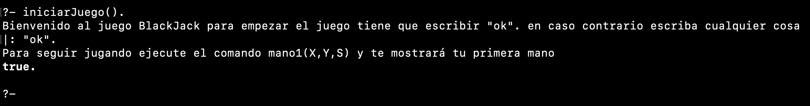

## Recibir primera mano
- Inicialmente se parte con dos cartas. Para obtener esas dos cartas tiene que ejecutar el siguiente comando: 
````
mano1(X,Y,S).
````  
- X representa la primera carta 
- Y representa la segunda carta 
- S representa el conjunto de cartas y su valor total.

Ejemplo 

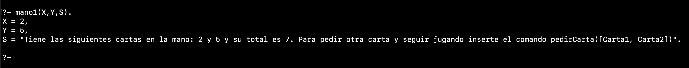
 

## Pedir carta usando la primera mano 

- Para pedir una carta e insertarla en nuestra mano tenemos que ejecutar el siguiente comando: 
```
pedirCarta([Carta1, Carta2]).
```
- Este predicado te devolverá la nueva carta aleatoria y el nuevo valor total de la mano al incorporar la nueva carta. 

Ejemplo

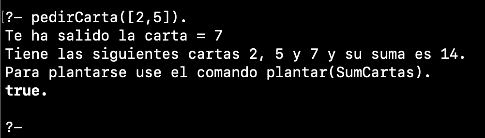

## Pedir carta cuando tienes tres cartas o más

- Si quieres arriesgarte y pedir otra carta para acercarte lo máximo posible a 21 tienes que ejecutar el comando anterior, pero añadiendo todas tus cartas actuales.

```
pedirCarta([Carta1, Carta2, Carta 3]).
```

Ejemplo

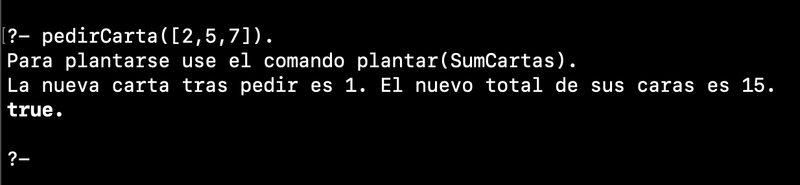

- Si el jugador pide muchas cartas puede llegar a 21 y por lo tanto, hacer BlackJack. Al hacer BlackJack automáticamente gana la partida. 

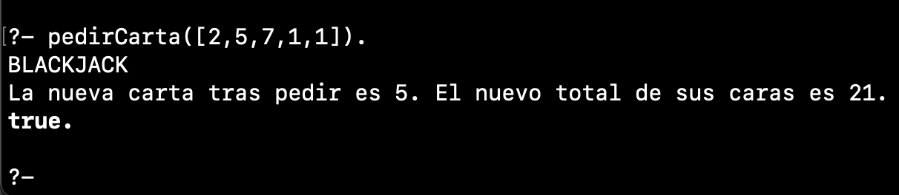

- Cuando el jugador pide cartas y el valor de su mano supera los 21, inmediatamente pierde el juego contra el dealer. 

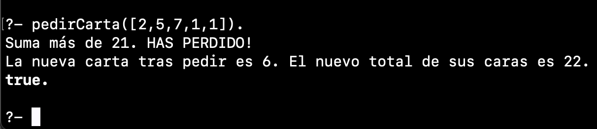

## Plantarse contra el dealer 

- Si estas satisfecho con tus cartas y crees que puedes ganar al dealer entonces utiliza el comando:
```
plantar(15).
```

- Hay tres resultados posibles que son: empate, perder y ganar. 
- Cuando el jugador y el dealer tienen los mismos puntos, empatarán. 

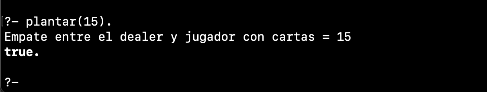

- Cuando el valor de la mano del jugador sea mayor que el dealer, significa que el jugador le ha ganado. 

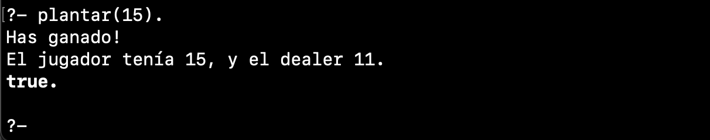

- Por último, cuando el valor de la mano del dealer es mayor que la del jugador, significa que el dealer ha ganado.

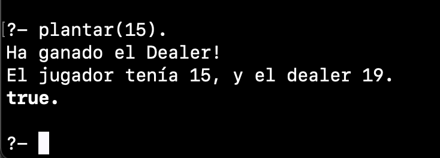

# Dos jugadores contra el Dealer

## Para ejecutar el juego necesitamos ejecutar los siguientes comandos:

- Para inicializar el juego ejecutaremos el siguiente comando:
```
iniciarJuego().
```
- Cuando se ejecute este comando te pedirá por consola que escribas "ok" (importante escribirlo con comillas y en minúscula y con punto incluido). para empezar el juego. Si escribes algo diferente se parará el juego. 

Ejemplo 


## Recibir primera mano para cada jugador.

- Inicialmente cada jugador partirá con dos cartas. Para que el jugador1 y el jugador2 obtenga las dos cartas tienen que ejecutar los siguientes comandos: 
````
mano1(X,Y,S).
````  
````
mano2(X,Y,S).
`````
- mano1(X,Y,S). Lo ejecutará el jugador1 
- mano2(X,Y,S). Lo ejecutará el jugador2. 
- X es la primera carta 
- Y es la segunda carta 
- S es conjunto de cartas y su total.

Ejemplo 

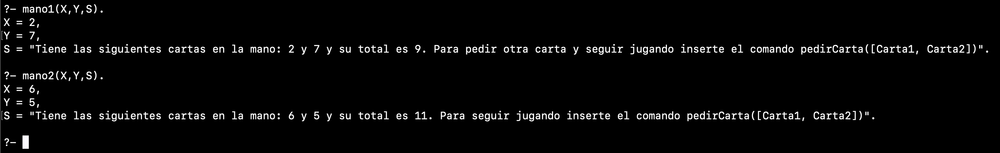

## Pedir carta usando la primera mano 

- Para pedir una carta e insertarla en nuestra mano tenemos que ejecutar el siguiente comando: 
```
pedirCarta([Carta1, Carta2]).
```
 
- Este predicado te devolverá la nueva carta aleatoria y se sumará con el resto de las cartas que tienes en la mano. 

- Como podemos observar a continuación, tenemos que pedir cartas para cada jugador ya que tienen manos diferentes y son independientes. 

- Como es el mismo predicado que hemos explicado anteriormente en el juego de un solo jugador, se aplican las mismas reglas que en el caso anterior. 

Ejemplo

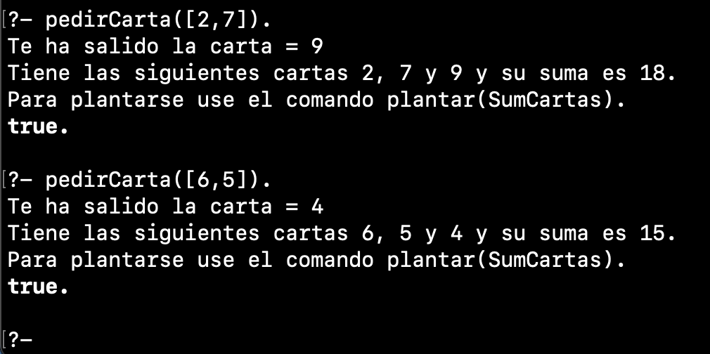

## Plantarse contra el dealer siendo dos jugadores

- Si estas satisfecho con tus cartas y crees que puedes ganar al dealer entonces utiliza el comando:
```
plantar(18,15).
```
- Siendo el 18 y el 15 la suma de la mano de cada jugador. 
- Hay tres resultados posibles que son: empate, perder y ganar. 
- Cuando un jugador y el dealer tienen la misma suma de cartas, se denomina empate. 

Ejemplo

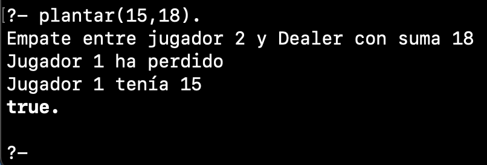

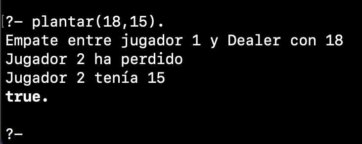


- Cuando el valor de la mano del jugador es mayor que la del dealer, significa que el jugador ha ganado esa ronda.

Ejemplo

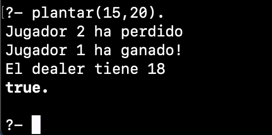

- Por último, si el valor de la mano del dealer es mayor que la de los jugadores, significa que el dealer ha ganado y, por lo tanto, el jugador ha perdido. 

Ejemplo

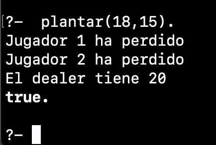
